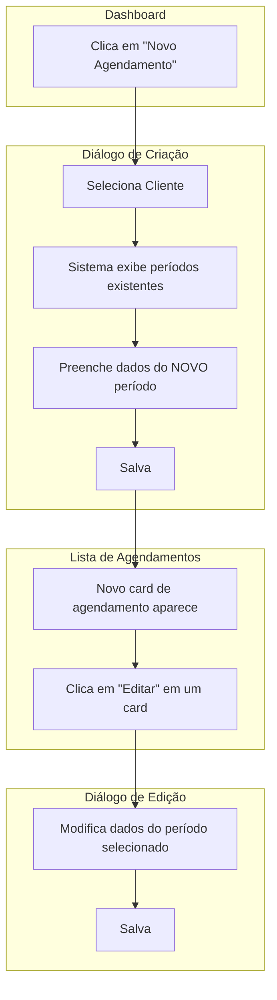

# 🎄 Seasonal Tune Planner

[](https://opensource.org/licenses/MIT)
[](https://reactjs.org/)
[](https://www.typescriptlang.org/)
[](https://tailwindcss.com/)

Sistema web avançado para **agendamento e gerenciamento de playlists sazonais de Natal**. Permite a configuração de múltiplos períodos de veiculação, tipos de playlist e estilos para diversos clientes, com um dashboard inteligente para acompanhamento em tempo real.

## ✨ Funcionalidades Principais

### 📊 Dashboard Dinâmico
- ✅ **Métricas em Tempo Real:** Acompanhe o status atual das operações com cards que mostram:
  - **Validade Próxima:** Quantos agendamentos vencem na semana atual, com um gráfico de distribuição diária.
  - **Clientes Agendados:** Total de clientes que possuem pelo menos um agendamento, com gráfico de pizza (Agendados vs. Não Agendados).
  - **Novos Agendamentos:** Contagem de novos períodos criados na semana, com gráfico de barras diário.
  - **Veiculação Natalinas:** Percentual e contagem de clientes com playlists ativas *hoje*, com gráfico de pizza (Veiculados vs. Não Veiculados).
- ✅ **Navegação Rápida:** Acesse a lista de clientes e agendamentos através de abas.

### 📅 Gestão de Agendamentos
- ✅ **Períodos Independentes:** Cada período de veiculação é um agendamento individual, permitindo flexibilidade total.
- ✅ **CRUD Completo:** Crie, edite e exclua agendamentos de forma simples e direta na lista principal.
- ✅ **Status Dinâmico:** A tag de status muda de `Agendado` para `Em Veiculação` automaticamente quando o período de veiculação inicia.

### 📋 Gestão de Validades
- ✅ **Página Dedicada:** Uma tela exclusiva (`/validade-semanal`) lista todos os agendamentos que expiram na semana atual.
- ✅ **Fluxo de Tratamento:** Marque agendamentos como "tratados" com um clique. O item é riscado na lista, e o contador no dashboard é atualizado.
- ✅ **Ação Reversível:** Desmarque um item como "tratado" a qualquer momento.

### 🏢 Gestão de Clientes
- ✅ **Cadastro Simplificado:** Adicione e gerencie clientes facilmente.
- ✅ **Importação em Lote:** Importe uma lista de clientes diretamente de um arquivo.

### 💡 Experiência de Uso (UX) Aprimorada
- ✅ **Adição Inteligente de Períodos:** Ao criar um novo agendamento, o sistema exibe o histórico de períodos do cliente selecionado, tornando a adição de novos períodos mais contextual e eficiente.
- ✅ **Interface Responsiva:** Acesse e gerencie o sistema de qualquer dispositivo.

---

## 🔄 Fluxo de Trabalho

O sistema agora trata cada período como um agendamento independente, simplificando a gestão.

### Para Adicionar um Período
1.  Clique em **"Novo Agendamento"**.
2.  Selecione um cliente. O sistema mostrará os períodos já existentes.
3.  Preencha o formulário para o novo período e salve.
4.  Um novo card de agendamento será criado na lista.

### Para Editar um Período
1.  Na lista de agendamentos, encontre o card do período desejado.
2.  Clique no ícone de **Editar**.
3.  Modifique as informações na janela e salve.



---

## 🛠️ Tecnologias

### Frontend
- **[React 18](https://reactjs.org/)** - Biblioteca UI moderna
- **[TypeScript](https://www.typescriptlang.org/)** - Tipagem estática
- **[Vite](https://vitejs.dev/)** - Build tool otimizada
- **[React Router](https://reactrouter.com/)** - Roteamento para SPAs
- **[Tailwind CSS](https://tailwindcss.com/)** - Framework CSS utility-first
- **[shadcn/ui](https://ui.shadcn.com/)** - Componentes UI elegantes
- **[Recharts](https://recharts.org/)** - Gráficos para React

### Backend & Dados
- **[Firebase](https://firebase.google.com/)** - Plataforma BaaS (Backend as a Service)
  - **Firestore** - Banco de dados NoSQL em tempo real
  - **GitHub Pages** - Hospedagem estática para o frontend

---

## 🚀 Início Rápido

### Pré-requisitos
- Node.js 18+
- npm ou yarn

### Instalação
1.  **Clone o repositório**
    ```bash
    git clone https://github.com/RodrigoMD2025/seasonal-tune-planner.git
    cd seasonal-tune-planner
    ```
2.  **Instale as dependências**
    ```bash
    npm install
    ```
3.  **Configure o ambiente**
    - Renomeie `.env.example` para `.env`
    - Preencha o arquivo `.env` com suas credenciais do Firebase.
4.  **Execute o projeto**
    ```bash
    npm run dev
    ```

### Deploy (GitHub Pages)
O projeto está configurado para deploy automático no GitHub Pages.

1.  **Build & Deploy**
    ```bash
    npm run deploy
    ```

---

## 📁 Estrutura do Projeto

```
sistema-playlist-natalina/
├── 📁 public/                 # Assets estáticos
├── 📁 src/
│   ├── 📁 components/         # Componentes React
│   │   └── 📁 ui/            # shadcn/ui components
│   ├── 📁 pages/             # Páginas completas (Dashboard, Validade Semanal)
│   ├── 📁 hooks/             # Custom React hooks
│   ├── 📁 lib/               # Utilitários (datas, etc)
│   └── ...
├── 📄 .firebaserc           # Projetos Firebase
├── 📄 .gitignore
├── 📄 package.json
├── 📄 vite.config.ts         # Config Vite
└── 📄 tsconfig.json          # Config TypeScript
```

---

## 🤝 Contribuição

Contribuições são bem-vindas! Siga o padrão de conventional commits.

```
feat: Nova funcionalidade
fix: Correção de bug
docs: Mudanças na documentação
style: Formatação, ponto e vírgula, etc.
refactor: Refatoração de código
perf: Melhoria de performance
test: Adição ou correção de testes
```

---

## 📝 Licença

Este projeto está sob a licença **MIT**.

---

<div align="center">

**Desenvolvido com ❤️ para a temporada natalina 🎄**

[⬆️ Voltar ao topo](#-seasonal-tune-planner)

</div>
