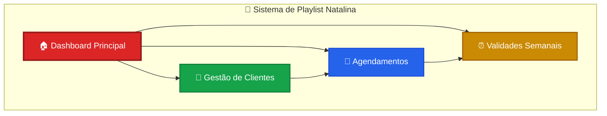
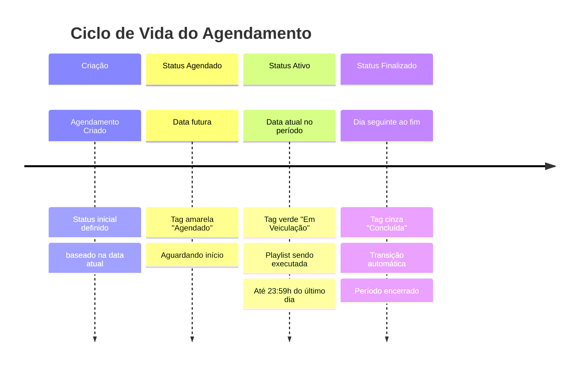
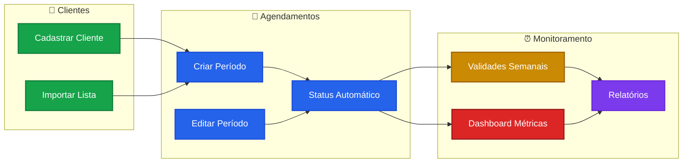

# 🎄 Seasonal Tune Planner

[](https://opensource.org/licenses/MIT)
[](https://reactjs.org/)
[](https://www.typescriptlang.org/)
[](https://tailwindcss.com/)

Sistema web avançado para **agendamento e gerenciamento de playlists sazonais de Natal**. Permite a configuração de múltiplos períodos de veiculação, tipos de playlist e estilos para diversos clientes, com um dashboard inteligente para acompanhamento em tempo real.

## ✨ Funcionalidades Principais

### 📊 Dashboard Dinâmico
- ✅ **Métricas em Tempo Real:** Acompanhe o status atual das operações com cards que mostram:
  - **Validade Próxima:** Quantos agendamentos vencem na semana atual, com um gráfico de distribuição diária.
  - **Clientes Agendados:** Total de clientes que possuem pelo menos um agendamento, com gráfico de pizza (Agendados vs. Não Agendados).
  - **Novos Agendamentos:** Contagem de novos períodos criados na semana, com gráfico de barras diário.
  - **Veiculação Natalinas:** Percentual e contagem de clientes com playlists ativas *hoje*, com gráfico de pizza (Veiculados vs. Não Veiculados).
- ✅ **Cálculos Precisos:** Lógica aprimorada para contagem de clientes ativos considerando horários exatos.
- ✅ **Navegação Rápida:** Acesse a lista de clientes e agendamentos através de abas.

### 📅 Gestão de Agendamentos
- ✅ **Períodos Independentes:** Cada período de veiculação é um agendamento individual, permitindo flexibilidade total.
- ✅ **CRUD Completo:** Crie, edite e exclua agendamentos de forma simples e direta na lista principal.
- ✅ **Status Dinâmico Inteligente:** Sistema de tags que atualiza automaticamente:
  - `Agendado` → `Em Veiculação` (quando o período inicia)
  - `Em Veiculação` → `Concluída` (automaticamente no dia seguinte ao fim do período)
- ✅ **Busca Avançada:** Filtre agendamentos por nome do cliente em tempo real.
- ✅ **Lógica de Datas Aprimorada:** Cálculos precisos considerando até 23:59h do último dia do período.
- ✅ **Relatórios Personalizados:** Exporte dados filtrados para Excel ou CSV com todas as informações dos agendamentos.

### 📋 Gestão Semanal Completa
- ✅ **Página Unificada:** Tela dedicada (`/validade-semanal`) com dois módulos principais:
  - **Validades da Semana:** Agendamentos que expiram na semana atual
  - **Veiculações da Semana:** Agendamentos ativos ou em período de veiculação
- ✅ **Sistema de Abas Intuitivo:** Navegação rápida entre os dois módulos
- ✅ **Fluxo de Tratamento:** Marque validades como "tratadas" com um clique
- ✅ **Acompanhamento Visual:** Status coloridos para diferentes estados de veiculação
- ✅ **Contadores Dinâmicos:** 
  - Validades: Pendentes vs Total Expirando
  - Veiculações: Ativas vs Total em Veiculação
- ✅ **Informações Rica:** Estilo musical, tipo de transmissão e períodos completos

### 📊 Sistema de Relatórios
- ✅ **Exportação Flexível:** Gere relatórios em formato Excel (.xlsx) ou CSV para análise externa
- ✅ **Filtros Inteligentes:** 
  - Todos os status ou filtro específico por: Em Veiculação, Agendado, Concluída, Cancelado
  - Contagem em tempo real dos registros que serão exportados
- ✅ **Opções de Ordenação:** 
  - Por nome do cliente (alfabética)
  - Por data de início (mais recente primeiro)
  - Por status (agrupamento lógico)
- ✅ **Dados Completos Exportados:**
  - Informações do cliente e período
  - Datas de início e término formatadas
  - Status dinâmico atual
  - Tipo de transmissão e estilo musical
  - Lista de tipos de playlist
  - Data de criação do agendamento

### 🏢 Gestão de Clientes
- ✅ **Cadastro Simplificado:** Adicione e gerencie clientes facilmente.
- ✅ **Importação em Lote:** Importe uma lista de clientes diretamente de um arquivo.

### 💡 Experiência de Uso (UX) Aprimorada
- ✅ **Adição Inteligente de Períodos:** Ao criar um novo agendamento, o sistema exibe o histórico de períodos do cliente selecionado, tornando a adição de novos períodos mais contextual e eficiente.
- ✅ **Interface Responsiva:** Acesse e gerencie o sistema de qualquer dispositivo.
- ✅ **Configuração Otimizada:** Environment variables organizadas para desenvolvimento e produção.
- ✅ **Visual Refinado:** Interface com cores temáticas natalinas e componentes padronizados.
- ✅ **Feedback Visual:** Tags coloridas para diferentes estados (Verde: ativo, Amarelo: agendado, Cinza escuro: concluída).
- ✅ **Layout Otimizado:** Header reorganizado para melhor distribuição dos botões de ação.
- ✅ **Gestão de Dados:** Sistema robusto de tratamento de timestamps do Firestore.

---

## 🆕 Melhorias Recentes

### v2.3.0 - Gestão Semanal Aprimorada
- ✅ **Página Unificada:** Combinação de "Validades da Semana" e "Veiculações da Semana" em uma interface única
- ✅ **Sistema de Abas:** Navegação intuitiva entre validades e veiculações
- ✅ **Acompanhamento de Veiculações:** Nova funcionalidade para monitorar agendamentos ativos durante a semana
- ✅ **Status Dinâmico Visual:** Badges coloridas para diferentes estados de veiculação
- ✅ **Informações Detalhadas:** Exibição de estilo musical, transmissão e períodos completos
- ✅ **Contadores Inteligentes:** Contagem separada para validades pendentes e veiculações ativas

### v2.2.0 - Sistema de Relatórios Completo
- ✅ **Exportação Excel/CSV:** Gere relatórios completos em formato Excel (.xlsx) ou CSV
- ✅ **Filtros Avançados:** Filtre por status (Em Veiculação, Agendado, Concluída, etc.)
- ✅ **Opções de Ordenação:** Ordene por nome do cliente, data de início ou status
- ✅ **Dados Completos:** Inclui todas as informações (cliente, período, datas, status, transmissão, playlists)
- ✅ **Interface Intuitiva:** Modal dedicado com configurações flexíveis de exportação
- ✅ **Correção de Timestamps:** Fix para exibição correta de datas do Firestore

### v2.1.0 - Sistema de Tags Dinâmicas Aprimorado
- ✅ **Transição Automática de Status:** O sistema agora gerencia automaticamente a transição completa:
  - `Agendado` (amarelo) → `Em Veiculação` (verde) → `Concluída` (cinza escuro)
- ✅ **Lógica de Tempo Precisa:** Considera até 23:59h do último dia para marcar como ativo
- ✅ **Finalização Automática:** No dia seguinte ao término, agendamentos passam automaticamente para "Concluída"

### v2.0.0 - Funcionalidades de Busca e UX
- ✅ **Filtro de Busca em Tempo Real:** Campo de busca para filtrar agendamentos por nome do cliente
- ✅ **Interface Refinada:** Componentes redesenhados com melhor hierarquia visual
- ✅ **Configuração Otimizada:** Organização melhorada dos arquivos de ambiente (.env)

### v1.9.0 - Dashboard com Métricas Avançadas
- ✅ **Gráficos Interativos:** Visualizações com Recharts para todas as métricas
- ✅ **Cálculos Inteligentes:** Algoritmos aprimorados para contagem de clientes ativos
- ✅ **Página de Validades:** Tela dedicada para gestão de agendamentos que expiram

---

## 📄 Fluxo de Trabalho

O sistema agora trata cada período como um agendamento independente, simplificando a gestão com total flexibilidade para configuração de playlists natalinas.

### 🎯 Visão Geral do Sistema



---

### 🆕 Para Adicionar um Novo Período

```mermaid
flowchart TD
    Start([🎯 Iniciar]) --> A[🏠 Acessar Dashboard]
    A --> B[➕ Clique em "Novo Agendamento"]
    B --> C[👤 Selecionar Cliente]
    
    C --> D{Cliente tem<br/>histórico?}
    D -->|Sim| E[📊 Sistema exibe<br/>períodos existentes]
    D -->|Não| F[📝 Primeiro agendamento<br/>do cliente]
    
    E --> G[📋 Preencher formulário<br/>do NOVO período]
    F --> G
    
    G --> H[📅 Definir datas<br/>início e fim]
    H --> I[🎵 Escolher tipo<br/>de playlist]
    I --> J[🎨 Selecionar estilo<br/>musical]
    J --> K[💾 Salvar agendamento]
    
    K --> L[✅ Novo card criado<br/>na lista]
    L --> M{Status<br/>automático}
    
    M --> N[⏳ Agendado<br/><em>amarelo</em>]
    M --> O[▶️ Em Veiculação<br/><em>verde</em>]
    M --> P[✅ Concluída<br/><em>cinza escuro</em>]
    
    N --> End([🎉 Processo<br/>Finalizado])
    O --> End
    P --> End
    
    %% Estilos
    style Start fill:#dc2626,stroke:#991b1b,stroke-width:3px,color:#fff
    style End fill:#16a34a,stroke:#15803d,stroke-width:3px,color:#fff
    style E fill:#fbbf24,stroke:#f59e0b,stroke-width:2px,color:#000
    style N fill:#fbbf24,stroke:#f59e0b,stroke-width:2px,color:#000
    style O fill:#16a34a,stroke:#15803d,stroke-width:2px,color:#fff
    style P fill:#6b7280,stroke:#4b5563,stroke-width:2px,color:#fff
```

---

### ✏️ Para Editar um Período Existente

```mermaid
flowchart TD
    Start([🔍 Localizar]) --> A[📋 Navegar na lista<br/>de agendamentos]
    A --> B[🔎 Usar busca por cliente<br/><em>opcional</em>]
    B --> C[🎯 Encontrar card<br/>do período desejado]
    C --> D[✏️ Clicar no ícone<br/>"Editar"]
    
    D --> E[📝 Janela de edição<br/>abre com dados atuais]
    E --> F{Que dados<br/>modificar?}
    
    F --> G[📅 Alterar datas]
    F --> H[🎵 Mudar tipo playlist]
    F --> I[🎨 Trocar estilo]
    F --> J[📝 Atualizar observações]
    
    G --> K[💾 Salvar alterações]
    H --> K
    I --> K
    J --> K
    
    K --> L[🔄 Card atualizado<br/>na lista]
    L --> End([✅ Edição<br/>Concluída])
    
    %% Estilos
    style Start fill:#2563eb,stroke:#1d4ed8,stroke-width:3px,color:#fff
    style End fill:#16a34a,stroke:#15803d,stroke-width:3px,color:#fff
    style E fill:#fbbf24,stroke:#f59e0b,stroke-width:2px,color:#000
    style K fill:#dc2626,stroke:#991b1b,stroke-width:2px,color:#fff
```

---

### 🏷️ Sistema de Tags Dinâmicas

O sistema gerencia automaticamente a transição de status baseado nas datas:



---

### 📊 Estados Visuais dos Agendamentos

| Status | Cor | Ícone | Descrição | Transição |
|--------|-----|-------|-----------|-----------|
| **Agendado** | 🟡 Amarelo | ⏳ | Período ainda não iniciou | ➡️ Automática no início |
| **Em Veiculação** | 🟢 Verde | ▶️ | Playlist ativa hoje | ➡️ Automática após 23:59h |
| **Concluída** | ⚫ Cinza Escuro | ✅ | Período finalizado | ➡️ Estado final |

---

### 🚀 Fluxo Completo de Gestão



---

### 💡 Dicas de Uso Eficiente

> **🎯 Produtividade Máxima**
> 
> 1. **📋 Use a busca** - Filtre rapidamente por nome do cliente
> 2. **👁️ Monitore o dashboard** - Acompanhe métricas em tempo real  
> 3. **⏰ Gerencie validades** - Trate agendamentos que expiram na semana
> 4. **🔄 Aproveite o histórico** - Visualize períodos anteriores ao criar novos
> 5. **🏷️ Confie nos status** - O sistema atualiza automaticamente as tags

---

### 🎄 Exemplo Prático de Uso

Imagine que você precisa configurar a playlist natalina para o **Shopping Center ABC**:

1. **👤 Cliente já cadastrado?** Se não, adicione rapidamente
2. **📅 Definir período:** 01/12 a 25/12/2024
3. **🎵 Escolher playlist:** "Natal Tradicional" 
4. **🎨 Selecionar estilo:** "Clássicos Natalinos"
5. **💾 Salvar:** Sistema cria o agendamento
6. **🏷️ Status automático:** "Agendado" até 01/12, depois "Em Veiculação"
7. **✅ Finalização:** Automaticamente "Concluída" em 26/12

**Resultado:** Gestão completamente automatizada! 🎉

---

## 🛠️ Tecnologias

### Frontend
- **[React 18](https://reactjs.org/)** - Biblioteca UI moderna
- **[TypeScript](https://www.typescriptlang.org/)** - Tipagem estática
- **[Vite](https://vitejs.dev/)** - Build tool otimizada
- **[React Router](https://reactrouter.com/)** - Roteamento para SPAs
- **[Tailwind CSS](https://tailwindcss.com/)** - Framework CSS utility-first
- **[shadcn/ui](https://ui.shadcn.com/)** - Componentes UI elegantes
- **[Recharts](https://recharts.org/)** - Gráficos para React
- **[XLSX](https://www.npmjs.com/package/xlsx)** - Biblioteca para geração de arquivos Excel/CSV

### Backend & Dados
- **[Firebase](https://firebase.google.com/)** - Plataforma BaaS (Backend as a Service)
  - **Firestore** - Banco de dados NoSQL em tempo real
  - **Environment Variables** - Configuração segura para desenvolvimento e produção
- **[GitHub Pages](https://pages.github.com/)** - Hospedagem estática para o frontend

---

## 🚀 Início Rápido

### Pré-requisitos
- Node.js 18+
- npm ou yarn

### Instalação
1.  **Clone o repositório**
    ```bash
    git clone https://github.com/RodrigoMD2025/seasonal-tune-planner.git
    cd seasonal-tune-planner
    ```
2.  **Instale as dependências**
    ```bash
    npm install
    ```
3.  **Configure o ambiente**
    - Renomeie `.env.example` para `.env`
    - Preencha o arquivo `.env` com suas credenciais do Firebase
    - Configure as variáveis VITE_API_URL para desenvolvimento/produção
4.  **Execute o projeto**
    ```bash
    npm run dev
    ```

### Deploy (GitHub Pages)
O projeto está configurado para deploy automático no GitHub Pages.

1.  **Build & Deploy**
    ```bash
    npm run deploy
    ```

---

## 📁 Estrutura do Projeto

```
sistema-playlist-natalina/
├── 📁 public/                 # Assets estáticos
├── 📁 src/
│   ├── 📁 components/         # Componentes React
│   │   └── 📁 ui/            # shadcn/ui components
│   ├── 📁 pages/             # Páginas completas (Dashboard, Validade Semanal)
│   ├── 📁 hooks/             # Custom React hooks
│   ├── 📁 lib/               # Utilitários (datas, etc)
│   └── ...
├── 📄 .firebaserc           # Projetos Firebase
├── 📄 .gitignore
├── 📄 package.json
├── 📄 vite.config.ts         # Config Vite
└── 📄 tsconfig.json          # Config TypeScript
```

---

## 🤝 Contribuição

Contribuições são bem-vindas! Siga o padrão de conventional commits.

```
feat: Nova funcionalidade
fix: Correção de bug
docs: Mudanças na documentação
style: Formatação, ponto e vírgula, etc.
refactor: Refatoração de código
perf: Melhoria de performance
test: Adição ou correção de testes
```

---

## 📝 Licença

Este projeto está sob a licença **MIT**.

---

<div align="center">

**Desenvolvido com ❤️ para a temporada natalina 🎄**

[⬆️ Voltar ao topo](#-seasonal-tune-planner)

</div>