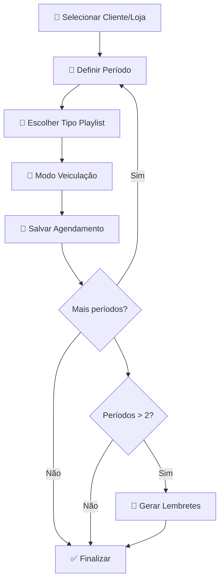

# 🎄 Sistema de Agendamento de Playlists Natalinas

[](https://opensource.org/licenses/MIT)
[](https://reactjs.org/)
[](https://www.typescriptlang.org/)
[](https://tailwindcss.com/)

Sistema web avançado para **agendamento e gerenciamento de playlists sazonais de Natal** no Player Music Delivery. Permite configuração personalizada de períodos, tipos de playlist e estilos de veiculação para múltiplos clientes e lojas.

## 🎯 Objetivo

Desenvolver uma plataforma completa que permita aos clientes configurar de forma intuitiva:
- **Períodos de veiculação** flexíveis
- **Tipos de playlist**: Instrumental, Vocal ou Instrumental + Vocal
- **Estilos de veiculação**: Mesclada (repertório base + natalinas) ou 100% Natal
- **Gestão multi-loja** para clientes corporativos
- **Sistema de lembretes automáticos** para múltiplos períodos

---

## ✨ Funcionalidades Principais

### 🏢 Gerenciamento de Clientes
- ✅ **CRUD completo** de clientes e lojas
- ✅ **Importação em lote** via arquivo CSV/Excel
- ✅ **Dashboard intuitivo** com visualização clara
- ✅ **Interface responsiva** para todos os dispositivos

### 📅 Sistema de Agendamento
- ✅ **Múltiplos períodos** por cliente/loja
- ✅ **Validação de conflitos** de datas automática
- ✅ **Configuração flexível** de tipos de playlist
- ✅ **Previsualização** de calendário de veiculação

### 🔔 Sistema de Alertas Inteligente
- ✅ **Lembretes automáticos** para períodos > 2
- ✅ **Notificações push/email** configuráveis
- ✅ **Alertas visuais** no painel administrativo
- ✅ **Calendário integrado** com marcações importantes

---

## 🔧 Cenários de Uso Suportados

### Exemplo 1: Configuração Simples
```
Cliente A - Loja Matriz
📅 01/11/2025 → 25/12/2025
🎵 Tipo: Instrumental
🔄 Veiculação: Mesclada
```

### Exemplo 2: Múltiplos Períodos
```
Cliente B - Shopping Center
📅 Período 1: 01/11/2025 → 10/12/2025
🎵 Tipo: Instrumental + Vocal | 🔄 Mesclada

📅 Período 2: 10/12/2025 → 31/12/2025  
🎵 Tipo: Instrumental | 🔄 100% Natal

🔔 Sistema gera alertas automáticos para troca
```

### Exemplo 3: Multi-loja
```
Cliente F - Rede de Varejo
🏪 Loja 1: Instrumental Mesclada (01/12 → 24/12)
🏪 Loja 2: Vocal 100% Natal (10/12 → 31/12)
```

---

## 🛠️ Tecnologias

### Frontend
- **[React 18](https://reactjs.org/)** - Biblioteca UI moderna
- **[TypeScript](https://www.typescriptlang.org/)** - Tipagem estática
- **[Vite](https://vitejs.dev/)** - Build tool otimizada
- **[Tailwind CSS](https://tailwindcss.com/)** - Framework CSS utility-first
- **[shadcn/ui](https://ui.shadcn.com/)** - Componentes UI elegantes
- **[React Router](https://reactrouter.com/)** - Roteamento SPA

### Backend & Dados
- **[Firebase](https://firebase.google.com/)** - Plataforma completa do Google
  - **Firestore** - Banco de dados NoSQL em tempo real
  - **Authentication** - Sistema de autenticação robusto
  - **Hosting** - Deploy automático e CDN global
  - **Cloud Functions** - Lógica de servidor serverless
  - **Cloud Storage** - Armazenamento de arquivos

### Testes & Qualidade
- **[Jest](https://jestjs.io/)** - Framework de testes
- **[React Testing Library](https://testing-library.com/react/)** - Testes de componentes
- **[ESLint](https://eslint.org/)** + **[Prettier](https://prettier.io/)** - Code quality

---

## 🚀 Início Rápido

### Pré-requisitos
- Node.js 18+ 
- npm ou yarn
- Conta Firebase (para produção)

### Instalação

1. **Clone o repositório**
   ```bash
   git clone https://github.com/seu-usuario/sistema-playlist-natalina.git
   cd sistema-playlist-natalina
   ```

2. **Instale as dependências**
   ```bash
   npm install
   # ou
   yarn install
   ```

3. **Configure o ambiente**
   ```bash
   cp .env.example .env
   # Edite o .env com suas credenciais Firebase
   ```

4. **Configurar Firebase**
   ```bash
   # Instalar Firebase CLI
   npm install -g firebase-tools
   
   # Fazer login
   firebase login
   
   # Inicializar projeto
   firebase init
   ```

5. **Variáveis de ambiente necessárias**
   ```env
   VITE_FIREBASE_API_KEY=sua_api_key
   VITE_FIREBASE_AUTH_DOMAIN=seu_projeto.firebaseapp.com
   VITE_FIREBASE_PROJECT_ID=seu_projeto_id
   VITE_FIREBASE_STORAGE_BUCKET=seu_projeto.appspot.com
   VITE_FIREBASE_MESSAGING_SENDER_ID=123456789
   VITE_FIREBASE_APP_ID=1:123456789:web:abcdef123456
   ```

5. **Execute o projeto**
   ```bash
   npm run dev
   # Disponível em http://localhost:5173
   ```

6. **Deploy para Firebase (opcional)**
   ```bash
   npm run build
   firebase deploy
   ```

---

## 📁 Estrutura do Projeto

```
sistema-playlist-natalina/
├── 📁 public/                 # Assets estáticos
├── 📁 src/
│   ├── 📁 components/         # Componentes React
│   │   ├── 📁 ui/            # shadcn/ui components
│   │   ├── 📁 layout/        # Layout components
│   │   ├── 📁 forms/         # Formulários
│   │   └── 📁 charts/        # Gráficos e visualizações
│   ├── 📁 pages/             # Páginas da aplicação
│   │   ├── Dashboard.tsx
│   │   ├── Clients.tsx
│   │   ├── Schedules.tsx
│   │   └── Calendar.tsx
│   ├── 📁 hooks/             # Custom React hooks
│   ├── 📁 lib/               # Utilitários e configurações
│   │   ├── firebase.ts       # Config Firebase
│   │   ├── utils.ts          # Funções utilitárias
│   │   └── validations.ts    # Schemas de validação
│   ├── 📁 types/             # Definições TypeScript
│   ├── 📁 services/          # Serviços Firebase
│   │   ├── auth.ts           # Autenticação
│   │   ├── firestore.ts      # Database operations
│   │   └── storage.ts        # Cloud Storage
│   └── 📁 __tests__/         # Testes
├── 📁 functions/             # Firebase Cloud Functions
│   ├── index.js             # Triggers e funções
│   ├── package.json         # Deps das functions
│   └── .eslintrc.js         # Config ESLint functions
├── 📁 firestore.rules        # Regras de segurança Firestore
├── 📁 storage.rules          # Regras de segurança Storage
├── 📄 firebase.json          # Config Firebase
├── 📄 .firebaserc           # Projetos Firebase
├── 📄 .env.example           # Template variáveis ambiente
├── 📄 tailwind.config.js     # Config Tailwind
├── 📄 vite.config.ts         # Config Vite
└── 📄 tsconfig.json          # Config TypeScript
```

---

## 🔄 Fluxo de Agendamento



---

## 📊 API Endpoints (Futuro)

### Clientes (Firestore)
```javascript
// Coleção: clients
GET    firestore.collection('clients')           # Listar clientes
POST   firestore.collection('clients').add()     # Criar cliente
PUT    firestore.doc('clients/:id').update()     # Atualizar cliente
DELETE firestore.doc('clients/:id').delete()     # Remover cliente
```

### Agendamentos (Firestore)
```javascript
// Coleção: schedules
GET    firestore.collection('schedules')                    # Todos agendamentos
GET    firestore.collection('schedules').where('clientId')  # Por cliente
POST   firestore.collection('schedules').add()             # Criar agendamento
PUT    firestore.doc('schedules/:id').update()             # Atualizar
DELETE firestore.doc('schedules/:id').delete()             # Remover
```

### Cloud Functions (Triggers)
```javascript
// functions/index.js
exports.onScheduleCreate = functions.firestore
  .document('schedules/{scheduleId}')
  .onCreate((snap, context) => {
    // Lógica para gerar lembretes automáticos
    // quando períodos > 2
  });
```

---

## 🧪 Testes

```bash
# Executar todos os testes
npm run test

# Testes com coverage
npm run test:coverage

# Testes em modo watch
npm run test:watch

# Testes E2E (futuro)
npm run test:e2e
```

### Estrutura de Testes
```
src/__tests__/
├── components/
│   ├── ClientForm.test.tsx
│   ├── ScheduleCalendar.test.tsx
│   └── AlertSystem.test.tsx
├── hooks/
│   ├── useClients.test.ts
│   └── useSchedules.test.ts
├── services/
│   └── firebase.test.ts
└── utils/
    └── dateValidation.test.ts
```

---

## 🔐 Autenticação e Segurança

### Firebase Auth
- **Providers**: Email/senha, Google, GitHub
- **Roles personalizados**: Admin, Manager, Client
- **Claims customizados** para controle de acesso
- **Verificação de email** obrigatória

### Firestore Security Rules
```javascript
rules_version = '2';
service cloud.firestore {
  match /databases/{database}/documents {
    // Apenas usuários autenticados
    match /clients/{clientId} {
      allow read, write: if request.auth != null 
        && request.auth.uid == clientId;
    }
    
    // Admins têm acesso total
    match /{document=**} {
      allow read, write: if request.auth != null 
        && request.auth.token.admin == true;
    }
  }
}
```

### Validação de Dados
- **Client-side**: React Hook Form + Zod
- **Server-side**: Cloud Functions + Firebase Admin
- **HTTPS obrigatório** em produção

---

## 🚀 Deploy

### Desenvolvimento Local
```bash
npm run dev              # Servidor desenvolvimento
firebase emulators:start # Emuladores Firebase local
```

### Build de Produção
```bash
npm run build           # Build otimizado
firebase deploy         # Deploy completo
```

### Deploy Seletivo
```bash
firebase deploy --only hosting           # Apenas frontend
firebase deploy --only functions         # Apenas Cloud Functions
firebase deploy --only firestore:rules   # Apenas regras Firestore
```

### Configuração de Ambientes
```bash
# Desenvolvimento
firebase use development

# Produção  
firebase use production

# Deploy para ambiente específico
firebase deploy --project production
```

---

## 📈 Roadmap

### v1.0 (Atual)
- [x] CRUD básico clientes/agendamentos
- [x] Sistema de alertas
- [x] Interface responsiva
- [x] Validações básicas

### v1.1 (Próximo)
- [ ] Cloud Functions para automações
- [ ] Notificações push via FCM
- [ ] Relatórios com Firebase Analytics
- [ ] Backup automático Firestore

### v2.0 (Futuro)
- [ ] Firebase Extensions
- [ ] Multi-tenancy com Security Rules
- [ ] Analytics avançado
- [ ] App mobile com Firebase SDK

---

## 🤝 Contribuição

Contribuições são muito bem-vindas! 

### Como contribuir:
1. **Fork** o projeto
2. **Crie** uma branch (`git checkout -b feature/nova-funcionalidade`)
3. **Commit** suas mudanças (`git commit -m 'feat: adiciona nova funcionalidade'`)
4. **Push** para a branch (`git push origin feature/nova-funcionalidade`)
5. **Abra** um Pull Request

### Padrões de Commit
```
feat: nova funcionalidade
fix: correção de bug
docs: atualização documentação
style: formatação código
refactor: refatoração
test: adição/correção testes
```

---

## 📝 Licença

Este projeto está sob a licença **MIT**. Veja o arquivo [LICENSE](LICENSE) para mais detalhes.

---

## 📞 Suporte

- **Email**: suporte@musicdelivery.com
- **Issues**: [GitHub Issues](https://github.com/seu-usuario/sistema-playlist-natalina/issues)
- **Documentação**: [Wiki do Projeto](https://github.com/seu-usuario/sistema-playlist-natalina/wiki)

---

## 📊 Stats do Projeto


---

<div align="center">

**Desenvolvido com ❤️ para a temporada natalina 🎄**

[⬆️ Voltar ao topo](#-sistema-de-agendamento-de-playlists-natalinas)

</div>